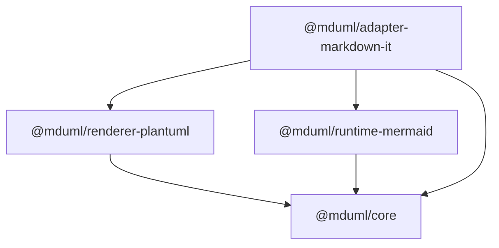

# MDUML (Markdown UML Flow Renderer)

[](LICENSE)
[](https://www.typescriptlang.org/)

A TypeScript monorepo providing consistent, orthogonal-first (horizontal/vertical edges) UML and flowchart rendering across multiple Markdown platforms.

## 🎬 Demo

Live demo (7 UML diagram types + Mermaid orthogonal comparison + Markdown playground) is deployed with the docs on GitHub Pages. Locally: `npm run demo` → http://localhost:4173/demo/

## ✨ Features

- **Multi-format Support**: Render Mermaid (` ```mermaid `) and PlantUML (` ```plantuml ` / ` ```uml `) code blocks
- **Orthogonal-first Layout**: Enforces clean, professional diagrams with horizontal/vertical edges and right-angle turns
- **Cross-platform Integration**:
  - Static sites via markdown-it plugin
  - VS Code extension (VSIX package)
  - Obsidian plugin
- **Automated Versioning**: Conventional Commits with independent package releases

## 📋 Diagram Style Guidelines

MDUML enforces a strict "orthogonal-first" visual style for all diagrams:

### Core Principles

- **Lines**: Prefer horizontal/vertical edges; avoid diagonal lines (45°) and arbitrary curves
- **Corners**: Use right-angle turns only (no rounded corners except crossing bridges)
- **Crossings**: 
  - Avoid edge crossings whenever possible
  - When unavoidable, use bridge/jump arcs (∩ shape) to indicate no connection
  - Never use direct cross intersections (confusing as connection points)
- **Alignment & Spacing**:
  - Align elements horizontally and vertically
  - Maintain consistent whitespace between elements
  - Follow left-to-right, top-to-bottom reading order
- **Labels**: Keep text horizontal and positioned close to related edges

### Visual Summary

```
✓ Horizontal/vertical lines    ✗ Diagonal lines
✓ Right-angle turns            ✗ Rounded corners
✓ Bridge jumps at crossings    ✗ Direct cross intersections
✓ Aligned elements             ✗ Overlapping elements
```

## 🏗️ Architecture

### Engine Support Matrix

| Engine | Orthogonal Routing | Crossing Bridges | Configuration |
|--------|-------------------|------------------|---------------|
| **Mermaid** | ✅ ELK + `elk.edgeRouting=ORTHOGONAL` | ✅ SVG post-processor (best-effort) | Enabled by default |
| **PlantUML** | ✅ `skinparam linetype ortho` | ⚠️ Not guaranteed | Enabled by default |

**Notes**:
- Mermaid: Automatic SVG post-processing adds bridge links at orthogonal crossings (skips unsafe intersections near endpoints/arrows)
- PlantUML: Bridge effects vary; prefer layout adjustments to avoid crossings

### Package Structure

#### Published Packages (npm)

- [`@mduml/core`](packages/core) - Core types and shared error-block rendering
- [`@mduml/renderer-plantuml`](packages/renderer-plantuml) - PlantUML diagram renderer
- [`@mduml/runtime-mermaid`](packages/runtime-mermaid) - Browser runtime for Mermaid rendering (single canonical orthogonal/jump-link implementation; ships ESM, CJS and a self-contained IIFE `UmlFlowRuntime` global bundle)
- [`@mduml/adapter-markdown-it`](packages/adapter-markdown-it) - markdown-it plugin and build-time CLI (Playwright batch rendering via `@mduml/runtime-mermaid`)

#### Application Packages (not published to npm)

- [`packages/adapter-vscode`](packages/adapter-vscode) → VSIX extension
- [`packages/adapter-obsidian`](packages/adapter-obsidian) → Obsidian plugin directory

### Dependency Graph



## 🚀 Quick Start

### Static Site Integration (markdown-it + Runtime Rendering)

#### Installation

```bash
npm install markdown-it @mduml/adapter-markdown-it @mduml/runtime-mermaid
```

#### Build-time Setup

```typescript
import MarkdownIt from "markdown-it";
import { umlFlowMarkdownItPlugin } from "@mduml/adapter-markdown-it";

const md = new MarkdownIt({ html: true });

md.use(umlFlowMarkdownItPlugin, {
  mode: "runtime", // Default: defer rendering to browser
  mermaid: {
    useElk: true,
    elkEdgeRouting: "ORTHOGONAL"
  }
});

const html = md.render(`
\`\`\`mermaid
graph TD
  A-->B
  B-->C
\`\`\`
`);
```

#### Browser Runtime Rendering

```typescript
import { renderAllMermaidBlocks } from "@mduml/runtime-mermaid";

// Render all Mermaid blocks after page load
await renderAllMermaidBlocks({
  defaultConfig: {
    debug: false,
    layout: {
      useElk: true,
      elkEdgeRouting: "ORTHOGONAL"
    }
  }
});
```

### Build-time SVG Generation (Playwright)

For server-side rendering without browser dependencies:

```bash
npm install --save-dev playwright
```

```typescript
md.use(umlFlowMarkdownItPlugin, {
  mode: "auto",
  buildBackend: {
    type: "playwright",
    timeoutMs: 20000
  },
  mermaid: {
    useElk: true,
    elkEdgeRouting: "ORTHOGONAL"
  }
});
```

### PlantUML Configuration

**Local Rendering** (Recommended):
```typescript
{
  plantuml: {
    localJarPath: "/path/to/plantuml.jar",
    javaExecutable: "java" // Optional: custom Java path
  }
}
```

**Remote Fallback** (Optional):
```typescript
{
  plantuml: {
    enableRemoteFallback: true,
    remoteServerUrl: "http://localhost:8080" // Your PlantUML server
  }
}
```

> ⚠️ Remote fallback is disabled by default for security. Enable explicitly when needed.

## 📦 Platform-Specific Guides

### VS Code Extension

#### Build & Package

```bash
# Build the extension
npm run build -w @mduml/adapter-vscode

# Create VSIX package
cd packages/adapter-vscode
npm run package:vsix
```

#### Installation

1. Open VS Code
2. Go to Extensions view (Ctrl+Shift+X)
3. Click "..." menu → "Install from VSIX..."
4. Select the generated `.vsix` file

### Obsidian Plugin

#### Build & Package

```bash
# Build the plugin
npm run build -w @mduml/adapter-obsidian

# Create plugin package
cd packages/adapter-obsidian
npm run package:plugin
```

#### Installation

1. Copy the built plugin folder to your vault:
   ```
   <your-vault>/.obsidian/plugins/uml-flow/
   ```
2. Open Obsidian Settings → Community Plugins
3. Click "Refresh" and enable "MDUML"

## 🛠️ Development

### Prerequisites

- Node.js 18+ 
- npm 9+

### Setup

```bash
# Clone repository
git clone <repository-url>
cd mduml

# Install dependencies
npm install

# Build all packages
npm run build

# Run tests
npm run test
```

### Available Scripts

```bash
# Build all packages
npm run build

# Clean build artifacts
npm run clean

# Run tests
npm run test

# Build specific package
npm run build -w @mduml/core
```

### Project Structure

```
mduml/
├── packages/
│   ├── core/                          # Core types + error block (zero deps)
│   ├── renderer-plantuml/             # PlantUML renderer
│   ├── runtime-mermaid/               # Browser runtime (single orthogonal/jump-link impl)
│   ├── adapter-markdown-it/           # markdown-it plugin + build-time CLI
│   ├── adapter-vscode/                # VS Code extension
│   └── adapter-obsidian/              # Obsidian plugin
├── scripts/                           # Build scripts
├── package.json                       # Workspace root
└── tsconfig.base.json                 # Shared TypeScript config
```

## 📝 Release & Versioning

### Commit Convention

This project uses [Conventional Commits](https://www.conventionalcommits.org/) for automated versioning:

```
feat: add new feature
fix: bug fix
docs: documentation changes
style: formatting changes
refactor: code refactoring
test: adding tests
chore: maintenance tasks
```

### Release Process

- **Independent Versioning**: Each package maintains its own version
- **Automatic Tagging**: Tags follow format `<package-name>-<version>`
  - Example: `@mduml/core-1.2.0`
- **Semantic Release**: Versions are determined automatically from commit history

## 🤝 Contributing

Contributions are welcome! Please feel free to submit a Pull Request.

1. Fork the repository
2. Create your feature branch (`git checkout -b feature/amazing-feature`)
3. Commit your changes using Conventional Commits
4. Push to the branch (`git push origin feature/amazing-feature`)
5. Open a Pull Request

## 📄 License

This project is licensed under the MIT License - see the [LICENSE](LICENSE) file for details.

## 🔗 Related Links

- [English Documentation](README.md)
- [中文文档](README.zh-CN.md)
- [📚 Detailed Docs](docs/)
- [Mermaid Documentation](https://mermaid.js.org/)
- [PlantUML Documentation](https://plantuml.com/)
- [markdown-it](https://github.com/markdown-it/markdown-it)
