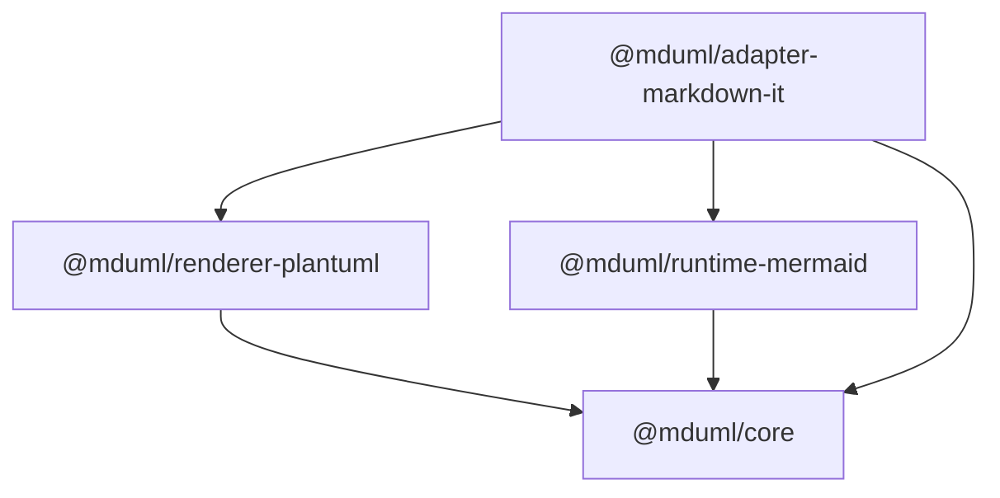

# MDUML（Markdown UML 流程图渲染）

[](LICENSE)
[](https://www.typescriptlang.org/)

MDUML 是一个 TypeScript monorepo 项目，旨在为多个 Markdown 平台提供一致的、横平竖直（正交优先）的 UML 和流程图渲染体验。

## ✨ 核心特性

- **多格式支持**：渲染 Mermaid (` ```mermaid `) 和 PlantUML (` ```plantuml ` / ` ```uml `) 代码块
- **正交优先布局**：强制使用水平/垂直边线和直角转弯，生成专业整洁的图表
- **跨平台集成**：
  - 通过 markdown-it 插件支持静态站点
  - VS Code 扩展（VSIX 包）
  - Obsidian 插件
- **自动化版本管理**：基于 Conventional Commits 的独立包发布

## 📋 图表样式规范

MDUML 强制执行严格的"正交优先"视觉风格：

### 核心原则

- **线条**：优先使用水平/垂直边线；避免斜线（45°）和任意曲线
- **转角**：仅使用直角转弯（除交叉跳线外，不使用圆角）
- **交叉处理**：
  - 尽可能避免边线交叉
  - 不可避免时，使用桥接跳线（∩ 形状）表示无连接关系
  - 禁止直接十字交叉（易被误读为连接点）
- **对齐与间距**：
  - 元素水平和垂直对齐
  - 元素间保持一致的空白间距
  - 遵循从左到右、从上到下的阅读顺序
- **标签**：文字保持水平书写，并靠近相关边线

### 视觉规范总结

```
✓ 横平竖直的线条          ✗ 斜线
✓ 直角转弯                ✗ 圆角转弯
✓ 交叉处使用跳线          ✗ 直接十字交叉
✓ 元素对齐                ✗ 元素重叠
```

## 🏗️ 架构设计

### 引擎支持矩阵

| 引擎 | 正交路由 | 交叉跳线 | 配置说明 |
|------|---------|---------|---------|
| **Mermaid** | ✅ ELK + `elk.edgeRouting=ORTHOGONAL` | ✅ SVG 后处理器（尽力而为） | 默认启用 |
| **PlantUML** | ✅ `skinparam linetype ortho` | ⚠️ 不保证效果 | 默认启用 |

**说明**：
- Mermaid：自动 SVG 后处理在正交交叉点添加桥接链接（跳过端点/箭头附近的不安全交叉点）
- PlantUML：跳线效果因情况而异；建议通过调整布局避免交叉

### 包结构

#### 发布包（npm）

- [`@mduml/core`](packages/core) - 核心类型和共享错误块渲染
- [`@mduml/renderer-plantuml`](packages/renderer-plantuml) - PlantUML 图表渲染器
- [`@mduml/runtime-mermaid`](packages/runtime-mermaid) - Mermaid 浏览器运行时（唯一正交/跳线实现；提供 ESM、CJS 和自包含 IIFE `UmlFlowRuntime` 全局包）
- [`@mduml/adapter-markdown-it`](packages/adapter-markdown-it) - markdown-it 插件和构建期 CLI（经 `@mduml/runtime-mermaid` 由 Playwright 批量渲染）

#### 应用包（不发布到 npm）

- [`packages/adapter-vscode`](packages/adapter-vscode) → VSIX 扩展
- [`packages/adapter-obsidian`](packages/adapter-obsidian) → Obsidian 插件目录

### 依赖关系图



## 🚀 快速开始

### 静态站点集成（markdown-it + 运行时渲染）

#### 安装

```bash
npm install markdown-it @mduml/adapter-markdown-it @mduml/runtime-mermaid
```

#### 构建时配置

```typescript
import MarkdownIt from "markdown-it";
import { umlFlowMarkdownItPlugin } from "@mduml/adapter-markdown-it";

const md = new MarkdownIt({ html: true });

md.use(umlFlowMarkdownItPlugin, {
  mode: "runtime", // 默认：延迟到浏览器渲染
  mermaid: {
    useElk: true,
    elkEdgeRouting: "ORTHOGONAL"
  }
});

const html = md.render(`
\`\`\`mermaid
graph TD
  A-->B
  B-->C
\`\`\`
`);
```

#### 浏览器运行时渲染

```typescript
import { renderAllMermaidBlocks } from "@mduml/runtime-mermaid";

// 页面加载后渲染所有 Mermaid 代码块
await renderAllMermaidBlocks({
  defaultConfig: {
    debug: false,
    layout: {
      useElk: true,
      elkEdgeRouting: "ORTHOGONAL"
    }
  }
});
```

### 构建时 SVG 生成（Playwright）

适用于无需浏览器依赖的服务器端渲染：

```bash
npm install --save-dev playwright
```

```typescript
md.use(umlFlowMarkdownItPlugin, {
  mode: "auto",
  buildBackend: {
    type: "playwright",
    timeoutMs: 20000
  },
  mermaid: {
    useElk: true,
    elkEdgeRouting: "ORTHOGONAL"
  }
});
```

### PlantUML 配置

**本地渲染**（推荐）：
```typescript
{
  plantuml: {
    localJarPath: "/path/to/plantuml.jar",
    javaExecutable: "java" // 可选：自定义 Java 路径
  }
}
```

**远程回退**（可选）：
```typescript
{
  plantuml: {
    enableRemoteFallback: true,
    remoteServerUrl: "http://localhost:8080" // 你的 PlantUML 服务器
  }
}
```

> ⚠️ 出于安全考虑，远程回退默认禁用。仅在需要时显式启用。

## 📦 平台特定指南

### VS Code 扩展

#### 构建与打包

```bash
# 构建扩展
npm run build -w @mduml/adapter-vscode

# 创建 VSIX 包
cd packages/adapter-vscode
npm run package:vsix
```

#### 安装步骤

1. 打开 VS Code
2. 进入扩展视图（Ctrl+Shift+X）
3. 点击 "..." 菜单 → "从 VSIX 安装..."
4. 选择生成的 `.vsix` 文件

### Obsidian 插件

#### 构建与打包

```bash
# 构建插件
npm run build -w @mduml/adapter-obsidian

# 创建插件包
cd packages/adapter-obsidian
npm run package:plugin
```

#### 安装步骤

1. 将构建的插件文件夹复制到你的仓库：
   ```
   <你的仓库>/.obsidian/plugins/uml-flow/
   ```
2. 打开 Obsidian 设置 → 社区插件
3. 点击"刷新"并启用"MDUML"

## 🛠️ 开发指南

### 前置要求

- Node.js 18+ 
- npm 9+

### 环境搭建

```bash
# 克隆仓库
git clone <repository-url>
cd mduml

# 安装依赖
npm install

# 构建所有包
npm run build

# 运行测试
npm run test
```

### 可用脚本

```bash
# 构建所有包
npm run build

# 清理构建产物
npm run clean

# 运行测试
npm run test

# 构建指定包
npm run build -w @mduml/core
```

### 项目结构

```
mduml/
├── packages/
│   ├── core/                          # 核心类型 + 错误块（零依赖）
│   ├── renderer-plantuml/             # PlantUML 渲染器
│   ├── runtime-mermaid/               # 浏览器运行时（唯一正交/跳线实现）
│   ├── adapter-markdown-it/           # markdown-it 插件 + 构建期 CLI
│   ├── adapter-vscode/                # VS Code 扩展
│   └── adapter-obsidian/              # Obsidian 插件
├── scripts/                           # 构建脚本
├── package.json                       # 工作区根配置
└── tsconfig.base.json                 # 共享 TypeScript 配置
```

## 📝 发布与版本管理

### 提交规范

本项目使用 [Conventional Commits](https://www.conventionalcommits.org/) 进行自动化版本管理：

```
feat: 添加新功能
fix: 修复 bug
docs: 文档变更
style: 代码格式变更
refactor: 代码重构
test: 添加测试
chore: 维护任务
```

### 发布流程

- **独立版本管理**：每个包维护自己的版本号
- **自动打标签**：标签格式为 `<package-name>-<version>`
  - 示例：`@mduml/core-1.2.0`
- **语义化发布**：版本根据提交历史自动确定

## 🤝 贡献指南

欢迎贡献！请随时提交 Pull Request。

1. Fork 本仓库
2. 创建特性分支（`git checkout -b feature/amazing-feature`）
3. 使用 Conventional Commits 规范提交更改
4. 推送到分支（`git push origin feature/amazing-feature`）
5. 提交 Pull Request

## 📄 许可证

本项目采用 MIT 许可证 - 详见 [LICENSE](LICENSE) 文件。

## 🔗 相关链接

- [English Documentation](README.md)
- [中文文档](README.zh-CN.md)
- [📚 详细文档](docs/)
- [Mermaid 文档](https://mermaid.js.org/)
- [PlantUML 文档](https://plantuml.com/)
- [markdown-it](https://github.com/markdown-it/markdown-it)
