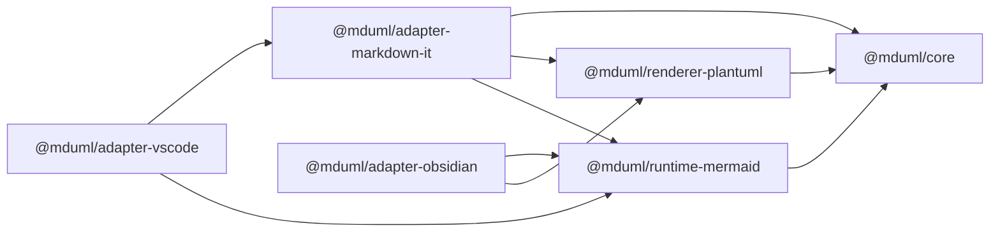
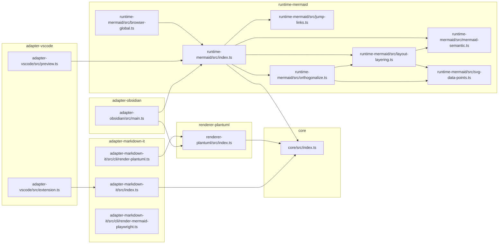

# CodeGraph — file & package relationships (mduml)

This graph is derived directly from `packages/*/src/**/*.ts` imports and each
package's `package.json` `dependencies`. See also [架构总览](maintainer/architecture.md).

Arrow direction is "depends on / imports": `A --> B` means A imports B.

## Package dependency graph

## Source-file dependency graph

## Notes

- `runtime-mermaid` is the largest module and is internally layered:
  `index.ts` → `jump-links`, `layout-layering`, `mermaid-semantic`, `orthogonalize`;
  `svg-data-points` is shared by `layout-layering` and `orthogonalize`.
  `browser-global.ts` re-exports the runtime for the self-contained IIFE build
  (`dist/runtime.global.js`, global name `UmlFlowRuntime`) used by the build-time
  CLI and plain `<script>` consumers.
- The renderer packages depend on third-party runtimes (`mermaid`,
  `@mermaid-js/layout-elk`, `playwright`) that are omitted here to keep the graph
  focused on project-owned files.
- `adapter-vscode/preview.ts` reaches mermaid through `@mduml/runtime-mermaid`;
  `extension.ts` reaches the markdown-it adapter (`extendMarkdownIt`).
