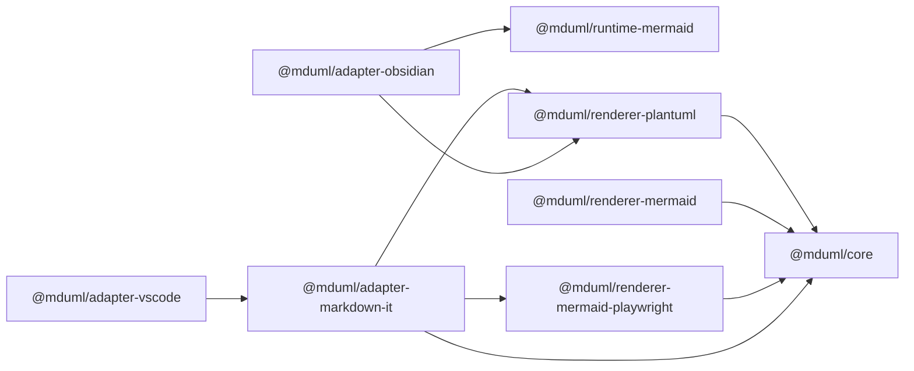
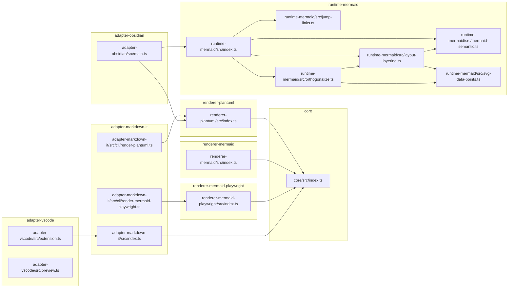

# CodeGraph — file & package relationships (mduml)

Generated from TypeScript `import ... from "..."` statements on the `dev` branch
(2026-08-28). No external `codegraph` CLI is installed in this environment, so this
graph was derived directly from `packages/*/src/**/*.ts` and each package's
`package.json` `dependencies`.

Arrow direction is "depends on / imports": `A --> B` means A imports B.

## Package dependency graph

## Source-file dependency graph

## Notes

- `runtime-mermaid` is the largest module and is internally layered:
  `index.ts` → `jump-links`, `layout-layering`, `mermaid-semantic`, `orthogonalize`;
  `svg-data-points` is shared by `layout-layering` and `orthogonalize`.
- `adapter-vscode/preview.ts` and the renderer packages depend on third-party runtimes
  (`mermaid`, `@mermaid-js/layout-elk`, `jsdom`, `dompurify`, `playwright`) that are
  omitted here to keep the graph focused on project-owned files.
- `adapter-vscode` reaches mermaid only through `preview.ts`, not through the
  markdown-it adapter path.
