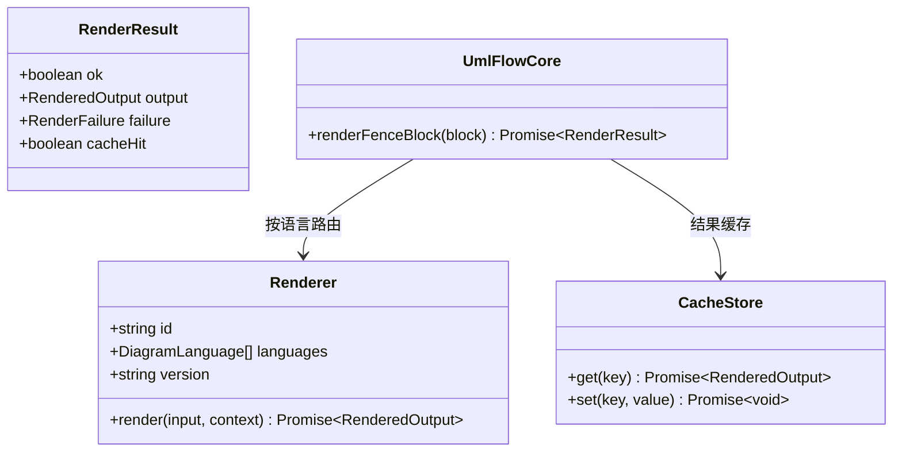

# API 参考

仓库共 8 个包：6 个发布到 npm，2 个是应用包（VS Code、Obsidian，`private: true` 不发布）。下面只列**对外导出**的公开 API。

## 核心：`@mduml/core`

定义共享类型与渲染编排，是所有渲染器/适配器的公共底座。

### 函数

| 导出 | 签名 | 说明 |
|------|------|------|
| `createUmlFlowCore(config)` | `(config: CoreConfig) => { renderFenceBlock }` | 创建核心编排器：按语言选渲染器、缓存、错误兜底 |
| `createRendererRegistry(renderers)` | `(renderers: Renderer[]) => { getByLanguage }` | 语言 → 渲染器注册表（先到先得） |
| `parseFenceBlocks(markdown)` | `(markdown: string) => FenceBlock[]` | 解析所有 fenced code block |
| `parseSupportedFenceBlocks(markdown)` | `(markdown: string) => ParsedFenceBlock[]` | 只保留 mermaid/plantuml/uml |
| `normalizeFenceLanguage(raw)` | `(raw: string) => DiagramLanguage \| null` | 规范化语言标签 |
| `defaultCacheStore()` | `() => CacheStore` | 内存 Map 缓存 |
| `createErrorBlockHtml(failure)` | `(failure: RenderFailure) => RenderedOutput` | 生成 HTML 错误块 |

### 类型

- `DiagramLanguage = "mermaid" | "plantuml" | "uml"`
- `RenderedOutput = { contentType: "image/svg+xml" | "text/html"; content: string }`
- `RenderResult = { ok: true; output; cacheHit } | { ok: false; failure; cacheHit }`
- `Renderer`、`RendererContext`、`CacheStore`、`CacheKeyParts`、`CoreConfig`、`FenceBlock`、`ParsedFenceBlock`、`RenderFailure`

`CoreConfig` 字段：`debug`、`cache`、`renderers`、`fenceOverrides`。

## Mermaid 运行时：`@mduml/runtime-mermaid`

浏览器端渲染与正交后处理的完整实现。

| 导出 | 签名 | 说明 |
|------|------|------|
| `renderMermaidCodeToSvg(input)` | `(input: RenderMermaidCodeInput) => Promise<RenderMermaidCodeResult>` | 单图渲染 + 正交后处理 |
| `renderAllMermaidBlocks(input?)` | `(input?: RenderAllMermaidBlocksInput) => Promise<void>` | 扫描页面 `.mermaid` 占位并逐个渲染 |
| `extractMermaidSemanticModel(input)` | `(input: RenderMermaidCodeInput) => Promise<...>` | 提取节点/边语义模型（调试/二次开发） |
| `createErrorBlockHtml(failure)` | `(failure) => string` | HTML 错误块 |

`RenderMermaidCodeResult = { ok: true; svg: string } | { ok: false; message: string }`。

同时 re-export：`MermaidSemanticNode`、`MermaidSemanticEdge`、`MermaidSemanticModel`。

## Mermaid 构建期渲染：`@mduml/adapter-markdown-it` CLI

构建期渲染已并入 `adapter-markdown-it`（旧 `renderer-mermaid` / `renderer-mermaid-playwright` 包已移除）：

- `cli/render-mermaid-playwright.js`：stdin 接收 `{ blocks: [{ id, code, config }], debug, backend }`，启动一次无头 Chromium，注入 `@mduml/runtime-mermaid` 的 IIFE 全局包（`UmlFlowRuntime`）批量渲染，stdout 返回 `{ ok, results: [{ id, ok, svg | message }] }`。
- `cli/render-plantuml.js`：stdin 接收 `{ blocks: [{ id, code, language }], config, debug }`，批量调用 PlantUML 渲染器，stdout 同上。

## PlantUML 渲染器：`@mduml/renderer-plantuml`

| 导出 | 签名 | 说明 |
|------|------|------|
| `createPlantUmlRenderer(options?)` | `(options?: { id?; config?: PlantUmlRendererConfig }) => Renderer` | 本地 jar 或远程 server 渲染 |

## markdown-it 适配器：`@mduml/adapter-markdown-it`

| 导出 | 签名 | 说明 |
|------|------|------|
| `umlFlowMarkdownItPlugin(md, options?)` | `(md: MarkdownIt, options?: UmlFlowMarkdownItOptions) => void` | 替换 fence 渲染规则（按文档批量构建期渲染） |
| `toMermaidRuntimeConfig(mermaid?, debug?)` | `(options?, debug?) => MermaidRuntimeConfig` | 把插件 mermaid 选项映射为 runtime 配置 |

类型：`UmlFlowMarkdownItOptions`、`UmlFlowMermaidOptions`、`UmlFlowPlantUmlOptions`、`UmlFlowPlaywrightBackendOptions`、`UmlFlowMarkdownItMode`、`UmlFlowMarkdownItModeSpec`（`"runtime" \| "build" \| "auto"` 或按语言分流对象 `{ mermaid?, plantuml? }`）、`cliDir?`（显式 CLI 目录，VSIX 打包场景）、`plantuml.remoteRender?` / `plantuml.remoteImageUrl?`（默认关闭的远程 `` 兜底）。

## 应用包（不发布）

### `@mduml/adapter-vscode`

- `activate(context)`：返回 `{ extendMarkdownIt }`（VS Code `markdown.markdownItPlugins` 约定）。
- `extendMarkdownIt(md)`：mermaid 以 runtime 占位、plantuml 以 `auto` 挂载 markdown-it 插件；webview 侧由 `markdown.previewScripts` 注入的脚本复用 `runtime-mermaid` 渲染。

### `@mduml/adapter-obsidian`

- `default class UmlFlowObsidianPlugin extends Plugin`：注册 `mermaid`、`plantuml`、`uml` 三个代码块处理器，并带设置面板。

## 典型组合

| 目标 | 组合 |
|------|------|
| 静态站点（运行时） | `adapter-markdown-it` + `runtime-mermaid` |
| 静态站点（构建期） | `adapter-markdown-it`（CLI 内置 Playwright 批量渲染） |
| PlantUML 本地渲染 | `renderer-plantuml`（或经 adapter 的 `plantuml` 配置） |
| 编辑器 | `adapter-vscode` / `adapter-obsidian` |
