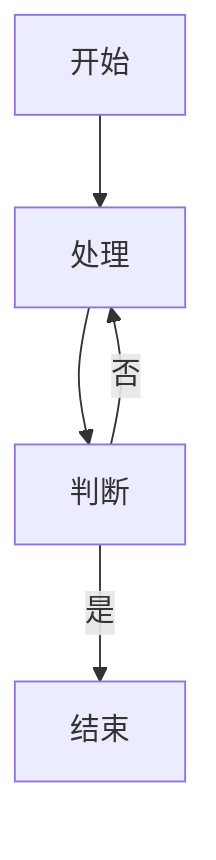

# 快速开始

MDUML 是一个 TypeScript monorepo，为多个 Markdown 平台提供一致、**正交优先**（横平竖直、直角转弯）的 UML / 流程图渲染体验。它支持 Mermaid 与 PlantUML 两种图源，并通过统一的核心接口把「解析 → 渲染 → 后处理」串成一条流水线。

## 它能做什么

- 把 Markdown 中的 ` ```mermaid `、` ```plantuml `、` ```uml ` 代码块渲染成 SVG。
- 强制横平竖直的边线、直角转弯，并在不可避免的交叉处插入「跳线」（∩ 形桥）。
- 在静态站点、VS Code、Obsidian 三个平台提供一致的体验。
- 支持**运行时渲染**（浏览器）与**构建期渲染**（Node / Playwright / PlantUML jar）两种模式。

## 面向谁

- **调用方**：想在自己的 Markdown 站点或编辑器里渲染图表的开发者，读本页与「配置参考」「API 参考」。
- **维护者**：想理解内部实现、参与开发的贡献者，读「维护者」分组的四篇文档。

## 安装

最常用的静态站点组合是 markdown-it 插件 + 浏览器运行时：

```bash
npm install markdown-it @mduml/adapter-markdown-it @mduml/runtime-mermaid
```

如果需要构建期生成 SVG（服务器端，无需浏览器）：

```bash
npm install --save-dev playwright
```

如果还需要 PlantUML 本地渲染：

```bash
# 下载 plantuml.jar 并准备 Java 运行时
npm install @mduml/renderer-plantuml
```

## 静态站点（markdown-it + 运行时渲染）

这是默认、最简单的集成方式：构建阶段只输出占位 DOM，真正的渲染推迟到浏览器。

### 1. 构建期配置

```typescript
import MarkdownIt from "markdown-it";
import { umlFlowMarkdownItPlugin } from "@mduml/adapter-markdown-it";

const md = new MarkdownIt({ html: true });

md.use(umlFlowMarkdownItPlugin, {
  mode: "runtime", // 默认值：延迟到浏览器渲染
  mermaid: {
    useElk: true,
    elkEdgeRouting: "ORTHOGONAL"
  }
});

const html = md.render(`
\`\`\`mermaid
graph TD
  A[开始] --> B[处理]
  B --> C[结束]
\`\`\`
`);
```

插件会把该代码块替换成一个带配置的占位元素：

```html
<div class="mermaid" data-uml-flow-mermaid-config="{...}">
graph TD
  A[开始] --> B[处理]
  B --> C[结束]
</div>
```

### 2. 浏览器端渲染

页面加载后调用 `renderAllMermaidBlocks()`，它会找到所有 `.mermaid` 占位元素并逐个渲染：

```typescript
import { renderAllMermaidBlocks } from "@mduml/runtime-mermaid";

await renderAllMermaidBlocks({
  defaultConfig: {
    debug: false,
    layout: {
      useElk: true,
      elkEdgeRouting: "ORTHOGONAL"
    }
  }
});
```

渲染成功后会得到一条正交风格的图：



## 构建期渲染（Playwright，服务器端 SVG）

当你不希望在浏览器里加载 Mermaid（例如纯静态 HTML 或 SSR），可以用 `mode: "auto"` 或 `mode: "build"`：

```typescript
md.use(umlFlowMarkdownItPlugin, {
  mode: "auto", // 先尝试构建期渲染，失败则回退到运行时占位
  buildBackend: {
    type: "playwright",
    timeoutMs: 20000
  },
  mermaid: {
    useElk: true,
    elkEdgeRouting: "ORTHOGONAL"
  }
});
```

- `mode: "build"`：构建期渲染失败时输出错误块（fail-fast）。
- `mode: "auto"`：构建期失败时回退为运行时占位元素，由浏览器兜底。

## PlantUML

PlantUML 无法在浏览器直接渲染，必须走构建期或外部服务。默认**本地 jar** 渲染：

```typescript
{
  plantuml: {
    localJarPath: "/path/to/plantuml.jar",
    javaExecutable: "java" // 可选
  }
}
```

可选远程兜底（默认关闭，出于安全考虑）：

```typescript
{
  plantuml: {
    enableRemoteFallback: true,
    remoteServerUrl: "http://localhost:8080"
  }
}
```

## VS Code 扩展

```bash
npm run build -w @mduml/adapter-vscode
cd packages/adapter-vscode
npm run package:vsix
```

然后：VS Code → 扩展视图 → "..." → "从 VSIX 安装…" → 选择生成的 `.vsix`。

## Obsidian 插件

```bash
npm run build -w @mduml/adapter-obsidian
cd packages/adapter-obsidian
npm run package:plugin
```

将构建产物复制到 `<仓库>/.obsidian/plugins/uml-flow/`，再到 Obsidian 设置 → 社区插件中启用 "MDUML"。

## 下一步

- 想调细节：读 [配置参考](configuration.md)。
- 想直接调用某个包：读 [API 参考](api-reference.md)。
