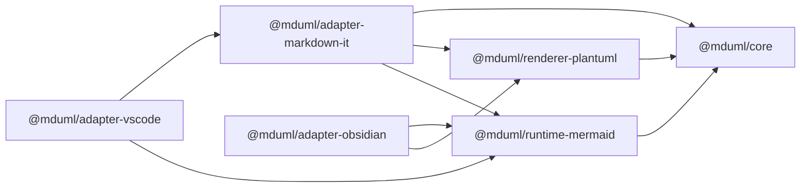
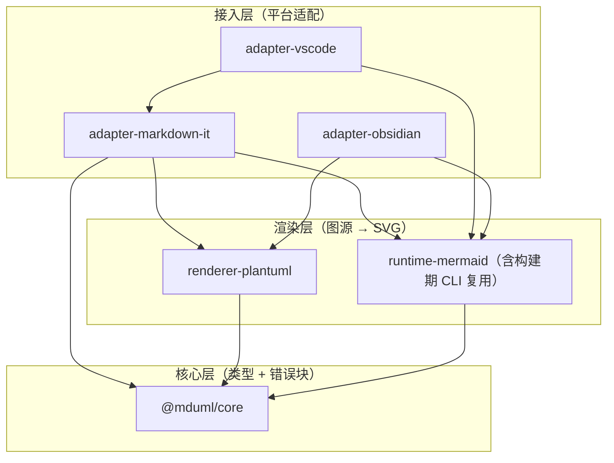

# 架构总览

MDUML 是一个 pnpm workspace monorepo，核心思想是**把「解析、渲染、正交后处理」拆成可独立发布的包**，再让各个平台的适配器薄薄地粘合它们。

## 包清单

| 包 | 类型 | 职责 |
|----|------|------|
| `@mduml/core` | 发布 | 共享类型 + 错误块渲染（零依赖） |
| `@mduml/renderer-plantuml` | 发布 | PlantUML 本地/远程渲染器 |
| `@mduml/runtime-mermaid` | 发布 | 浏览器运行时 + **唯一**正交/跳线实现（ESM/CJS/IIFE 全局包三种产物） |
| `@mduml/adapter-markdown-it` | 发布 | markdown-it 插件 + 构建期 CLI（Playwright 加载 runtime-mermaid 批量渲染） |
| `@mduml/adapter-vscode` | 应用 | VS Code 扩展（VSIX） |
| `@mduml/adapter-obsidian` | 应用 | Obsidian 插件 |

## 依赖关系

箭头表示「依赖 / import」：

要点：

- `core` 是被广泛依赖的底座，**没有第三方依赖**；`createErrorBlockHtml` 是全仓唯一错误块实现，`runtime-mermaid` 在其上做字符串包装。
- `runtime-mermaid` 只依赖 `core`、`mermaid` 与 `@mermaid-js/layout-elk`，是**唯一的**正交/跳线实现，物理上不存在第二份。
- `adapter-markdown-it` 是静态站点的中枢：mermaid 经 CLI 由无头 Chromium 加载 runtime-mermaid 的 IIFE 包批量渲染（每篇文档一次浏览器启动）；PlantUML 走本地 jar CLI。
- VS Code：`markdownItPlugins` 声明 + `activate()` 返回 `extendMarkdownIt`（mermaid=runtime 占位、plantuml=auto），`previewScripts` 在 webview 内复用 runtime-mermaid 渲染占位块；Obsidian 直接调用 runtime 与 PlantUML 渲染器。

更细的**源文件级**依赖图见 [代码关系图](../codegraph.md)。

## 分层

## 关键设计决策

1. **`Renderer` 统一接口**：所有图源渲染器实现同一条 `render(input, context) => Promise<RenderedOutput>`，上层按语言路由，不关心底层是 Playwright 还是 PlantUML jar。
2. **运行时 / 构建期双通道**：markdown-it 插件支持按语言分流（`mode` 可传 `{ mermaid, plantuml }`），mermaid 在 VS Code 走占位 + 客户端渲染，PlantUML 走构建期 jar；构建期渲染按文档**批量**执行（一次 CLI 调用渲染全部代码块）。
3. **正交后处理与 Mermaid 解耦**：不修改 Mermaid 源码，而是在其产出的 SVG 上做「语义提取 → 分层 → 布线 → 跳线」，因此能跟随 Mermaid 升级。
4. **PlantUML 仅配置式**：通过 `skinparam linetype ortho` / `roundcorner` 注入正交风格，不重写 PlantUML 布局引擎；另提供默认关闭的 `remoteRender` 远程图片兜底（`` 直连 PlantUML 服务器，零 Java，注意会把图文本发送到服务器）。

## 正交实现：只有一份

历史上正交/跳线逻辑曾复制 4 份（runtime-mermaid、jsdom 版、Playwright 内联版、VS Code preview 版），2026-08 重构后收敛为 `runtime-mermaid` 单份：

- VS Code preview 与 Obsidian 直接 import；
- 构建期 CLI 把 `runtime.global.js` 注入无头页面后调 `UmlFlowRuntime.renderMermaidCodeToSvg`。

新增能力一律落在 `runtime-mermaid`，不要再复制。
