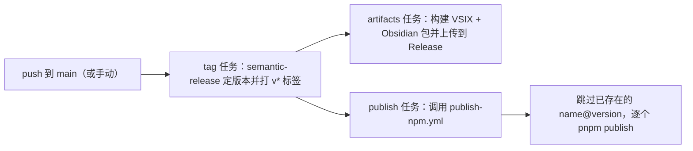

# 构建与发布

## 本地开发

前置：Node.js 18+，pnpm 10.x（`packageManager` 锁定为 `pnpm@10.33.3`）。

```bash
git clone <repository-url>
cd mduml
pnpm install
pnpm run build   # 按依赖顺序构建全部 8 个包
pnpm run test    # 运行有测试的包（core / renderer-plantuml / runtime-mermaid / adapter-markdown-it）
```

构建单包：

```bash
pnpm -w --filter @mduml/core run build
```

## 目录约定

每个包都是 `tsup` 构建，输出到 `dist/`；`tsconfig.base.json` 提供共享的 `strict`、`ES2022 + DOM` 等编译选项。测试统一是「最小 smoke test」，验证核心函数能跑通，不做单元测试堆砌：

- `core/tests/smoke-test.ts`：验证 fence 解析与核心编排。
- `runtime-mermaid/tests/smoke-test.ts`：验证渲染 + 正交 + 跳线。
- `adapter-markdown-it/tests/smoke-test.ts`：验证插件输出占位/内联。

## 新增一个渲染器 / 包

最小改动路径：

1. 在 `packages/` 新建目录与 `package.json`（发布包设 `"private": false`）。
2. 实现 `Renderer` 接口（`id`、`languages`、`version`、`render`）。
3. 若希望它进入 markdown-it 管线，在 `adapter-markdown-it` 中接入。
4. 加到根 `package.json` 的 `build`/`test` 脚本链。

## CI（`.github/workflows/ci.yml`）

对 `main`/`dev` 的 push 与所有 PR 触发：checkout → 装 Node 24 + pnpm → `pnpm install --frozen-lockfile` → `pnpm run build` → `pnpm run test`。

## 发布（`.github/workflows/release.yml` + `publish-npm.yml`）

基于 [semantic-release](https://semantic-release.gitbook.io/) 与 Conventional Commits：



- **独立版本**：每个发布包维护自己的版本号；标签格式 `<package>-<version>`（如 `@mduml/core-1.2.0`）。
- **npm provenance**：发布时开启 `NPM_CONFIG_PROVENANCE`。
- 仅当产生新标签时才会触发下游的 artifacts 与 publish 任务。

### 提交规范

```
feat: 新功能
fix:  修复
docs: 文档
chore: 维护（含依赖）
```

## 本地打包 VS Code / Obsidian

```bash
pnpm -w --filter @mduml/adapter-vscode run package:vsix
pnpm -w --filter @mduml/adapter-obsidian run package:plugin
```

产物分别在 `packages/adapter-vscode/dist/vsix/` 与 `packages/adapter-obsidian/dist/obsidian-plugin/`。
