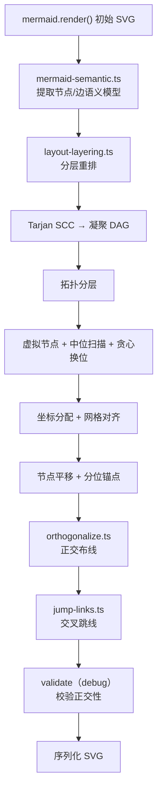
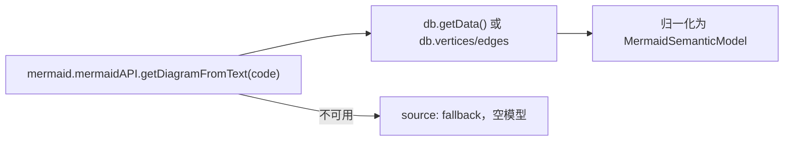
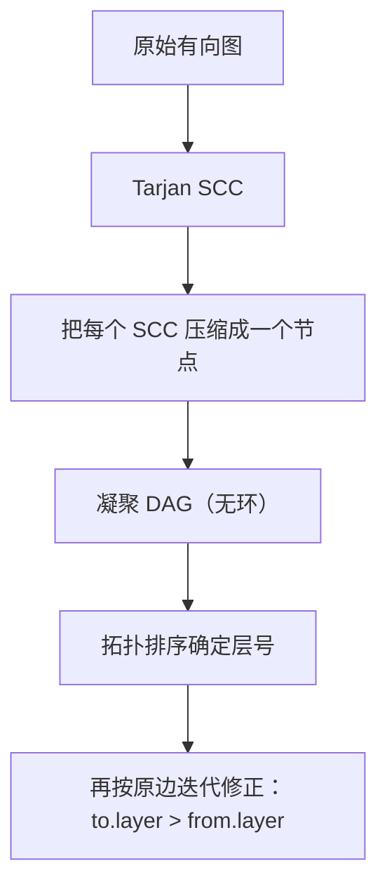
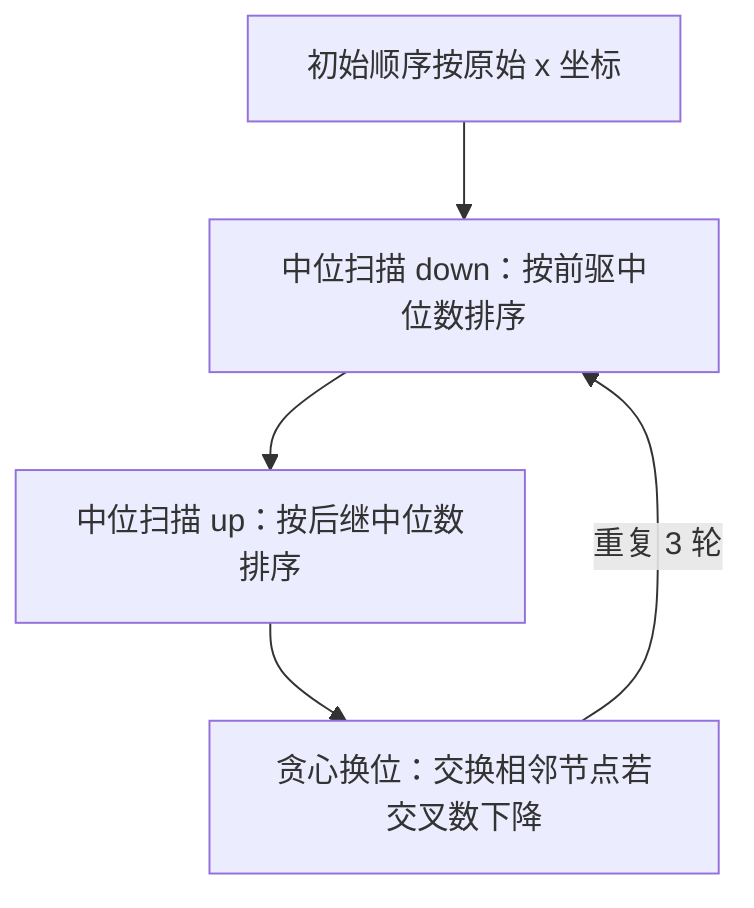
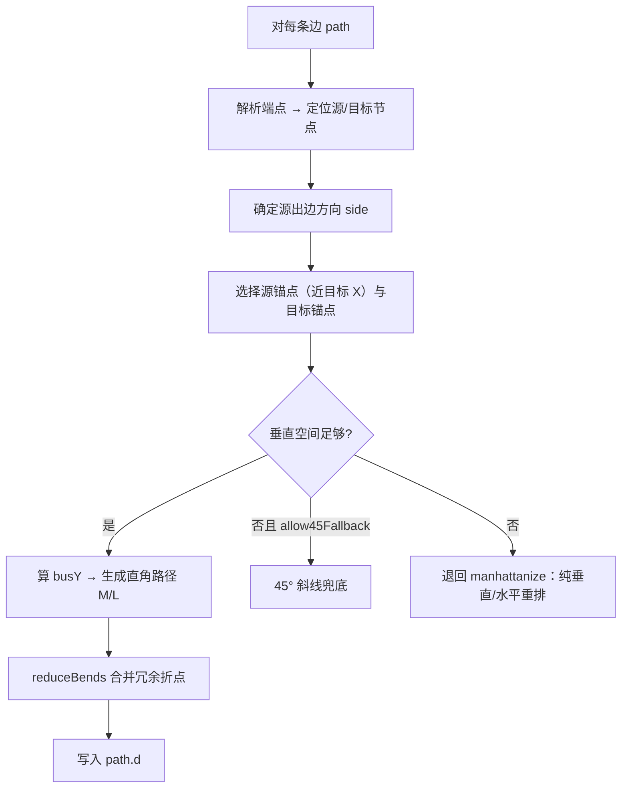
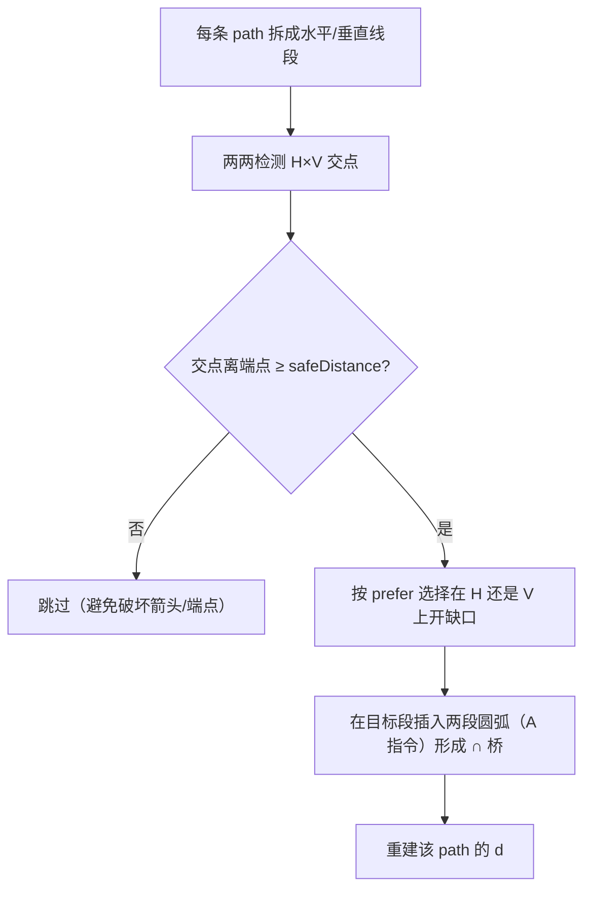

# 正交布局算法

这是整个项目最核心、也最复杂的一部分，全部位于 `@mduml/runtime-mermaid` 的 5 个源文件里。目标：**在 Mermaid 产出的 SVG 之上，把边重排成横平竖直、直角转弯、交叉处跳线**的「工程制图」风格。

## 为什么不在 Mermaid 里做

Mermaid 的 ELK 布局能给出大致合理的节点位置与 `ORTHOGONAL` 边，但无法保证「网格对齐」「总线对齐」「交叉跳线」「菱形精确锚点」等细节。所以 MDUML 采用**后处理**策略：先让 Mermaid 渲染，再读回语义与几何，自己重排节点、重写边的 `d` 属性。

## 总流水线



## 1. 语义提取 `mermaid-semantic.ts`



它尝试从 Mermaid 内部取回**图数据库**中的节点与边（含 `from`/`to`、label、parentId、isGroup）。这一步很重要：仅靠 SVG 路径反推边关系不可靠（曲线、自环、重叠），语义模型提供「谁连向谁」的权威答案。

取不到时降级为空模型，后续 `layout-layering` 会退回「用 SVG 端点 + 最近节点」猜测边关系。

## 2. 分层 `layout-layering.ts`

分层解决「边方向尽量向下」的问题，并尽量少交叉。

### 2.1 强连通分量 → 凝聚 DAG



为什么先做 SCC：循环依赖（如 `C --> B` 回边）会让朴素拓扑分层卡住。先把环压成一个分量，再在分量内部统一层号。

### 2.2 跨层边与虚拟节点

对于跨越多个层的长边，在中间层插入 `__virtual__` 节点，把长边拆成相邻层短边。这样后续的交叉计数与排序只需要处理相邻层。

### 2.3 层内排序（减少交叉）



这是经典的 Sugiyama 风格启发式：中位扫描（median heuristic）快而稳，贪心换位（greedy swap）再局部精修。交叉数通过相邻层边对判断「上游顺序与下游顺序是否相反」来计数。

### 2.4 坐标分配

每层内节点从左到右排开，整层相对画布水平居中；`gapX` 控制同层间距，`gapY` 控制层间距；所有坐标最后 `snap` 到 `gridSize` 的整数倍。支持 `fixedLayerY` 强制指定某些层的 Y。

### 2.5 锚点 `buildNodeAnchors`

每个节点四条边各计算一组**分位锚点**（中位、二等分、三等分…），供布线时选「离目标 X 最近」的出脚点。菱形节点特殊处理：直接取四个角点。

## 3. 正交布线 `orthogonalize.ts`



一条典型边被重写为五段式直角路径（以「底部出、顶部入」为例）：

```text
源底部中点 → 竖直下到 busY → 水平到目标 x → 竖直上到目标顶部
```

`busY` 由 `busLayerRatio` 决定两层之间的水平总线位置，让多条边的水平段尽可能共用一条「总线」，视觉上更整洁。

若分层重排失败（无节点/无边/取不到锚点），会退回 `manhattanize`：仅把原路径的每个点吸附到网格并强制水平/垂直交替，保证结果仍是正交。

## 4. 交叉跳线 `jump-links.ts`

当两条不同边的水平段与垂直段相交时，直接画十字会被误读为连接点，于是插入一个「∩」形桥。



跳线方向由 `side`（左/右/上/下）与 `sweep`（圆弧方向）控制；同一线段上多个跳点会先按方向排序、再去重（间距小于 `radius*3` 视为重复）。

## 5. 校验 `orthogonalize.ts#validateOrthogonalResult`

仅在 `debug` 开启时输出告警：检测曲线指令（C/Q/S/T）、斜线段（dx 与 dy 同时非零）、首段/末段方向是否合法。它**不修改**输出，只作为回归观测手段。

## 与你该改哪个文件

| 想要的效果 | 改这里 |
|------------|--------|
| 分层/减少交叉 | `layout-layering.ts` 的排序与坐标分配 |
| 边的出脚方向、总线位置 | `orthogonalize.ts` 的 `resolveSourceSide` / busY |
| 跳线外观（大小、朝向） | `jump-links.ts` 的 `buildPathWithInserts` / `resolveSweepFlag` |
| 更准的节点/边关系 | `mermaid-semantic.ts` |
| 网格、间距等默认值 | 各包的 `layoutPolicy` 归一化函数 |
