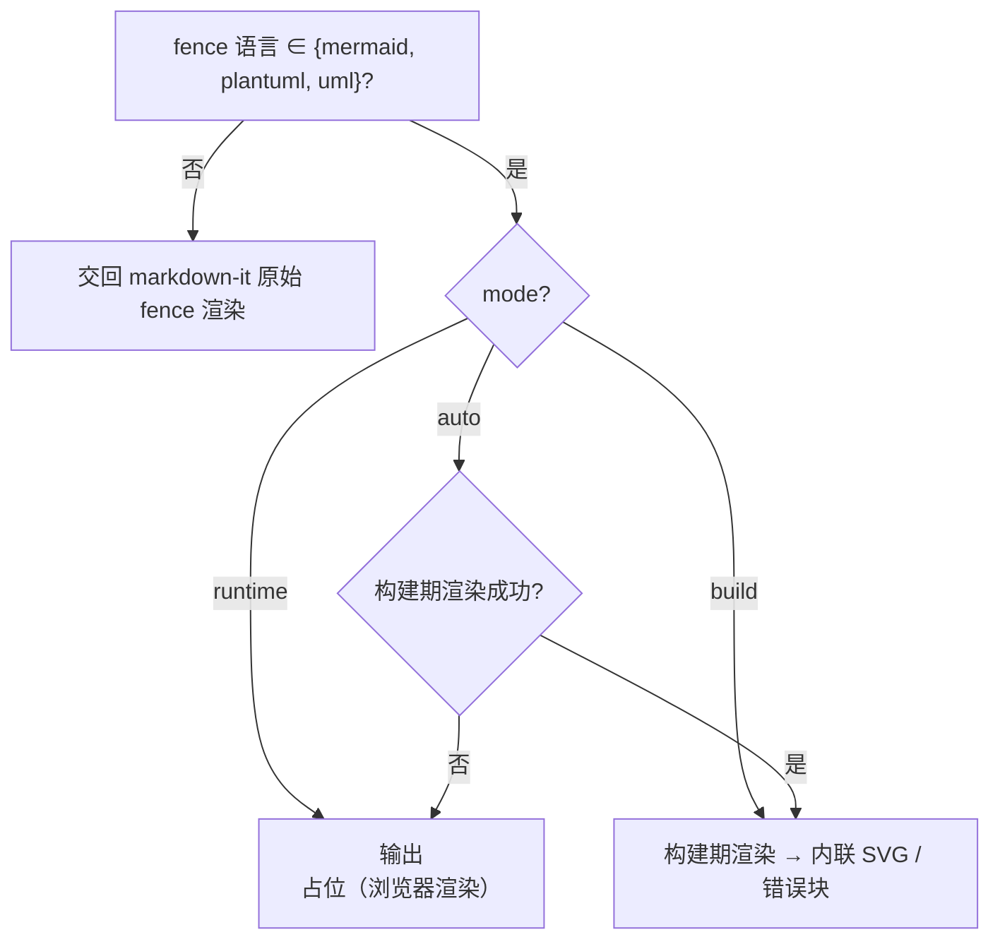
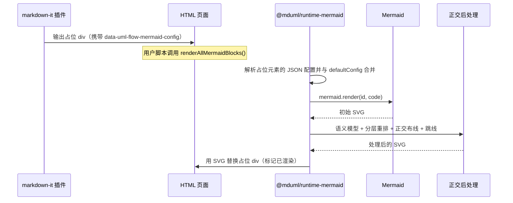
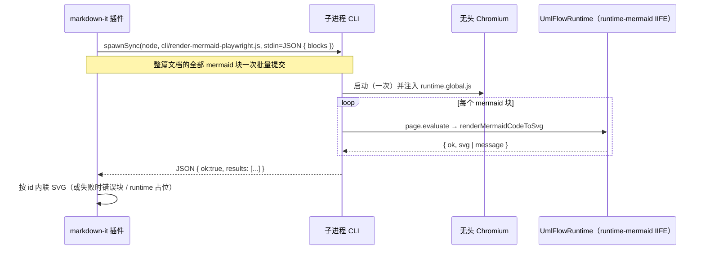
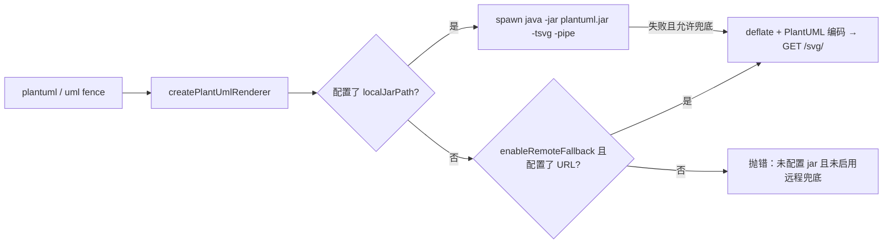
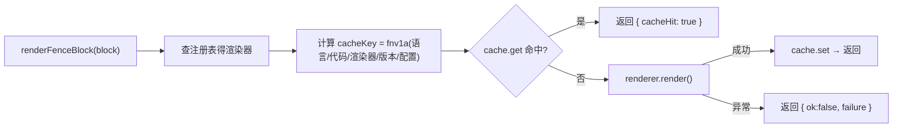

# 渲染管线

无论走哪条路径，整体都遵循：**识别 fence → 选渲染器 → 生成 SVG → 正交后处理 → 输出**。区别只在「渲染发生在构建期还是浏览器」，以及后处理的实现深度。

## 模式总览



## 运行时渲染（Mermaid）



关键点：

- 占位元素通过 `data-uml-flow-mermaid-config` 携带**每图独立配置**；`renderAllMermaidBlocks` 用 `mergeRuntimeConfig` 逐字段覆盖默认配置。
- 元素渲染后写入 `dataset.umlFlowRendered = "true"`，重复调用会跳过，避免二次渲染。
- 若语义模型提取或后处理抛错，全部被 `try/catch` 兜底，返回 Mermaid 原始 SVG，保证「宁可少正交、不可渲染失败」。

## 构建期渲染（Mermaid，Playwright）



为什么用子进程而非直接 import：markdown-it 插件需要同时支持 ESM/CJS 且避免把 `playwright`（可选 peer 依赖）变成硬依赖；`spawnSync` 让「Playwright 没装」时干净地返回错误并触发 `auto` 回退。批量协议保证每篇文档只启动一次 Chromium（旧实现逐块 spawn + 逐块启动浏览器，N 张图 N 次冷启动）。

## PlantUML 管线



PlantUML 渲染前会注入正交风格（除非源码已声明）：

```plantuml
skinparam linetype ortho
skinparam roundcorner 0
```

## 核心缓存（`@mduml/core`）

`createUmlFlowCore` 内部有一条缓存链：



- 缓存键对 JSON 做**键排序后**再 FNV-1a，保证配置对象键顺序不影响命中。
- 默认 `defaultCacheStore` 是内存 Map；可注入持久化 `CacheStore`（如 Redis/文件）。
- 渲染异常不会中断整个文档，而是转为 `RenderFailure`，由上层输出错误块。

## 错误兜底

所有层级的错误最终都收敛成同一风格的 HTML 块（`.uml-flow-error`），字段为 `rendererId` 与安全转义后的 `message`，避免把未转义文本注入页面。
